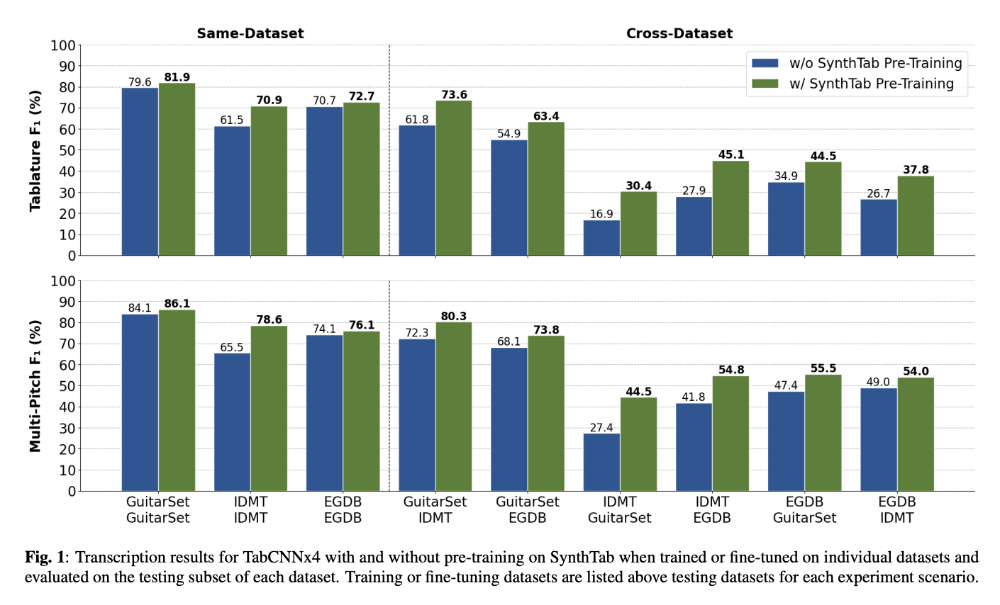

# SynthTab: Leveraging Synthesized Data for Guitar Tablature Transcription
Yongyi Zang*, Yi Zhong* (Equal Contribution), Frank Cwitkowitz, Zhiyao Duan

We created a large-scale synthesized guitar tablature dataset to address the low-resource problem in guitar tablature transcription. This repository contains code for our rendering pipeline, along with our baseline models (TabCNN, TabCNNx4) and our trained embeddings.

[[Project Website](https://synthtab.dev/)] [[Paper Link](https://arxiv.org/pdf/2309.09085.pdf)] 



## Known Bugs

Thanks to Jackson Loth from QMUL, we discovered some rendering bugs in our pipeline. When two same-pitched notes are played on the same string in sequence with no gap in between (i.e. first note's offset == second note's onset), the commericial VST we used would sometimes ignore the second note.

For acoustic guitars, 8994/11132 (80.8%) of the songs are affected; each song contains a mean of 1.48 seconds and standard deviation of 4.77 seconds of affected regions. For each acoustic guitar that contains these bugs, 127.66/3511.35 (3.63%) hours of total playing time is problematic. The most affected song contains 423 seconds of bug, while the least affected song contains 0.026 seconds of it.

For electric guitars, 32179/38838 (82.9%) of the songs are affected; each song contains a mean of 1.08 seconds and standard deviation of 4.97 seconds of affected regions. For each electric guitar that contains these bugs, 340.73/9601.54 (3.55%) hours of total playing time is problematic. The most affected song contains 472 seconds of bug, while the least affected song contains 0.011 seconds of it. It's worth noting that due to the large size of the dataset, we did not render all electric guitar MIDIs, but randomly sampled from the pool; so the distribution should be similar, but the exact numbers may differ.

We will release the exact timestamps of problematic regions soon.

## Updates
- **Feb 2023**: The full SynthTab dataset has been uploaded to MEGA and Baidu Netdisk. Feel free to download and use it!
- **Dec 2023**: SynthTab is accepted at ICASSP 2024!

## Cite Us
If you use SynthTab as part of your research, please cite us according to the following BibTeX:
```
@inproceedings{synthtab2024,
  title={SynthTab: Leveraging Synthesized Data for Guitar Tablature Transcription},
  author={Zang, Yongyi and Zhong, Yi and Cwitkowitz, Frank and Duan, Zhiyao}
  booktitle={ICASSP 2024-2024 IEEE International Conference on Acoustics, Speech and Signal Processing (ICASSP)},
  year={2024},
  organization={IEEE}
}
```

## Downloading SynthTab

The development set of SynthTab is available at [here](https://rochester.app.box.com/v/SynthTab-Dev). This is a relatively small set that can help you start developing, and train later on the larger full dataset.

The full dataset is hosted at [UR Box](https://rochester.app.box.com/v/SynthTab-Full). If you are in mainland China, we provide a [Baidu Netdisk link](https://pan.baidu.com/s/1PF8EAHkHmFhx7ySVRbWMDA) (Password: gjwq) for easy access of the same content. Total file size is close to and less than 2 TB. You should be able to download only the parts you need.

SynthTab is released with CC BY-NC 4.0 license (learn more about it [here](https://creativecommons.org/licenses/by-nc/4.0/deed.en)).

File structure is as follows:
```
SynthTab
|---all_jams_midi_V2_60000_tracks.zip
|---acoustic
|---|---gibson_thumb
|---|---|---part_1_-_1_to_B_C_.zip
|---|---|---...
|---|---...
|---electric
|---|---electric_clean
|---|---electric_distortion
|---|---electric_muted
```

Each zip file is less than 50 GB, so you could only download the parts you need. `acoustic`, `electric_clean`, `electric_distortion` and `electric_muted` directories contain different timbres as `*.zip` files. The JAMS files are stored separatedly in `all_jams_midi_V2_60000_tracks.zip`. It is relatively small at around 1 GB. 

Within each song's rendered files, we also provide per-string extracted fundamental frequency (stored as `*.pkl` files). We used the YIN algorithm for this. See `MIDI_to_Audio/render.py` for the exact implementation of the extraction process.

Although for training the baseline models, we downsampled the dataset to 22050 Hz, the original dataset is rendered at 44100 Hz, and is therefore provided as such. For more detailed description of this process, please refer to our paper.

## Structure
This repository is modular, as every part of it can be re-used to generate other similar dataset using our methodology. The repository is structured as follows:

`gp_to_JAMS` folder contains all necessary code to generate JAMS files from Guitar Pro files.

`JAMS_to_MIDI` folder contains all necessary code to generate MIDI files (per-string) from JAMS files.

`MIDI_to_audio` folder contains all necessary code to generate audio files (per-guitar-mic) from MIDI files - they are currently designed to take the output from `JAMS_to_MIDI` folder, but can be easily further customized.

`demo_data` contains a small portion of our data that allows for development of the algorithm; once your algoirthm is ready, simply download your dataset and follow the similar file structure.

`demo_embedding` is where we put our benchmark pre-trained models, with a simple demo script for training and running evaluation.

In each folder you will find the corresponding README file, explaining how the content of that folder works.
